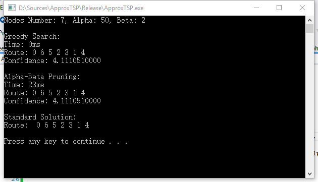
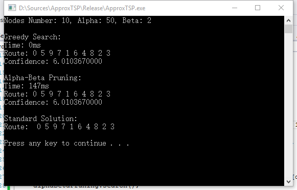
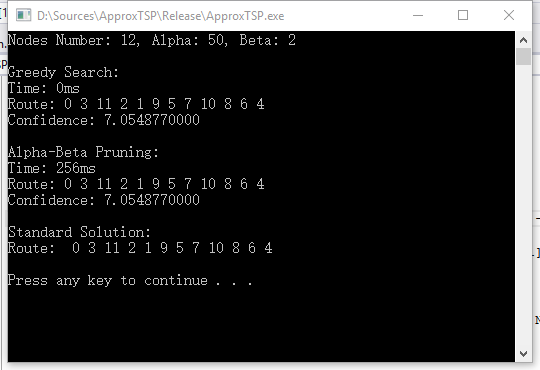
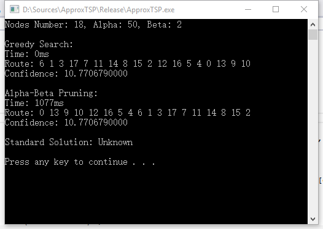

# ApporxTSP

Author: Yongqing Liang

## 1. Source codes
- **main.cpp**: The entry of the program.
- **utils**: Some useful functions.
- **Node**: Declare the node of the search tree.
- **Alpha-Beta Pruning**: The alpha-beta pruning algorithm to solve TSP approximately.
- **Greedy Search**: The greedy search algorithm  to solve TSP approximately. It is a special case of alpha-beta pruning when alpha==1 and beta==0.

## 2. Arguments

1. **DataId**: Integer. The index of the real data. (Can not be NULL)
2. **Alpha**: Integer. The number of the nodes which will be ergodic. (Default: 50)
3. **Beta**: Integer. The depth of the further evaluation. (Default: 2)

## 3. Build / Test Enviornment

VS2013, Windows 10

## 4. Running Result

1. Real Test 1:

2. Real Test 2:

3. Real Test 3:

4. Real Test 4:
